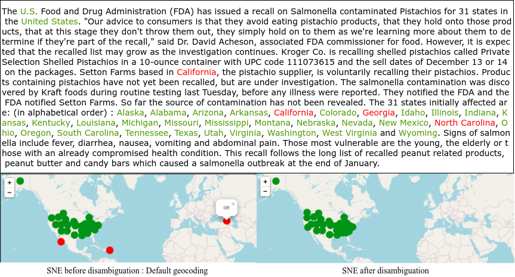
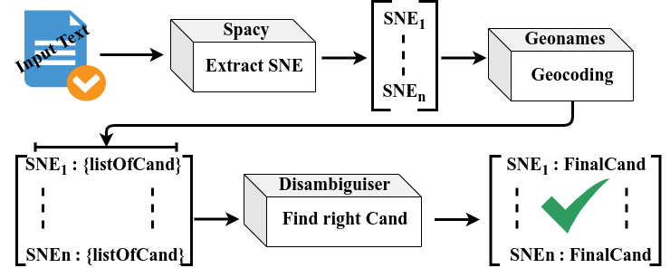

-----------------------------------------



Main description
----------------

In Natural Language Processing (NLP), the notion of space becomes a very important component when it comes to analyzing textual data that describe or report  spatio-temporal events. Commonly identified and called Spatial Named Entities (SNE), they correspond to the place names that are mentioned in a document. We can distinguish two types: absolute named entities, or those that can be identified by longitude, latitude coordinates, such as city names (e.g. Montpellier, France, etc.) and relative named entities that are generally defined by complements of indication, or direction, etc. (ex: North of Paris, South of France, etc.). 

Analyzing a document taking into account the place names can be a great challenge, since it can carry several nuances, making it ambiguous. We can distinguish three common cases of ambiguity:

   - Case No.1 : a spatial named entity can be shared by different places (e.g. Montpellier from France and Montpellier from Canada);
   - Case No.2 : a spatial named entity can designate both a place and a non-place (e.g. a lake named after a person);
   - Case No.3 : the same place can be designated by several names or several appellations.

The Snetoolkit is a python module called that allows to overcome the different forms of ambiguity that a spatial entity detected in a document can encounter.


Snetoolkit 
---------------

The Snetoolkit  is a set of tools that helps to deal with Spatial Named Entities (SNE). There are three mains functionnalities 

1 Extraction of SNE from textual document : this function is based on spacy

2 SNE Geocoding : gives coordinate of a given SNE based on the Geonames DataBase. There two type of geocoding 
   - default candidate geocoding : return one candidate that corresponds to the default result of Geoname;
   - multi candidates geocoding  : return a top@X (e.g, top@10 - frist 10 results) candidates from Geonames result.
     
3 Disambiguation of ambiguous SNE
   - this function is based on multiple technics, that helps to disambiguate ambiguous SNE. Based on the multi candidate geocoding, the disambiguation is supposed to return the right candidate from the multiple ones.


Quick start
-----------

First, you need to edit the params.py file in order to provide your Geonames key.

Then clone the project: 
   ```
   git clone https://github.com/rdius/Snetoolkit.git
   ```
   ```
   You can specify your Geonames API key in the src.params.py file
   ```

Install the requiered packages:

    pip install -r requirements.txt

If you want to extract SNE (only GPE & LOC are considered) from text, geocod and disambiguate them:

   ``` python
   # import main packages
   from Snetkit import spacySne # for SNE extraction
   from Snetkit import getDefltCand   # for default geocoding
   from Snetkit import getMultiCand # for multi candidate, uuse this for disambiguation purpose
   from Snetkit import applyDisamb # apply disambiguation on multi-candidate extrated SNE
   
   doc = "The U.S. Food and Drug Administration (FDA) has issued a recall on Salmonella contaminated Pistachios for 31 states in the United States. Our advice to consumers is that they avoid eating pistachio products, that they hold onto those products, that at this stage they don't throw them out, they simply hold on to them as we're learning more about them to determine if they're part of the recall, said Dr. David Acheson, associated FDA commissioner for food. However, it is expected that the recalled list may grow as the investigation continues. Kroger Co. is recalling shelled pistachios called Private Selection Shelled Pistachios in a 10-ounce container with UPC code 111073615 and the sell dates of December 13 or 14 on the packages. Setton Farms based in California, the pistachio supplier, is voluntarily recalling their pistachios. Products containing pistachios have not yet been recalled, but are under investigation. The salmonella contamination was discovered by Kraft foods during routine testing last Tuesday, before any illness were reported. They notified the FDA and the FDA notified Setton Farms. So far the source of contamination has not been revealed.  The 31 states initially affected are: (in alphabetical order) : Alaska, Alabama, Arizona, Arkansas, California, Colorado, Georgia, Idaho, Illinois, Indiana, Kansas, Kentucky, Louisiana, Michigan, Missouri, Mississippi, Montana, Nebraska, etc."
   
   sne_list = spacySne(doc) # extract the list of SNE mentionned in the text
   
   >>> ['United States', 'California', 'Alaska', 'Alabama', 'Arizona', 'Arkansas', 'California', 'Colorado', 'Georgia', 'Idaho', 'Illinois', 'Indiana', 'Kansas', 'Kentucky', 'Louisiana', 'Michigan', 'Missouri', 'Mississippi', 'Montana', 'Nebraska']
   
   df = getDefltCand(sne_list)
   
   >>>
   
                                         name        lat         lng Country Code Type  Population
      0                      South America  -14.60485   -57.65625         None    L   385742554
      1                            Arizona    34.5003  -111.50098           US    A     5863809
      2                        Kansas City   39.09973   -94.57857           US    P      475378
      3   Indianapolis-Carmel-Anderson, IN   39.74743   -86.20614           US    L     1890000
      4                           Acadiana   30.12595   -92.00939           US    L     1880000
      5                           Nebraska   41.50028   -99.75067           US    A     1757399
      6                             Alaska   64.00028  -150.00028           US    A      660633
      7                   Colorado Springs   38.83388  -104.82136           US    P      456568
      8                Southern California   34.68743  -116.78467           US    L    22000000
      9                           Missouri   38.25031   -92.50046           US    A     5768151
      10                          Arkansas   34.75037   -92.50044           US    A     2757631
      11                             Idaho    44.5002  -114.25118           US    A     1416564
      12                          Illinois   40.00032   -89.25037           US    A    12772888
      13         East South Central States   34.60739   -86.97977           US    L    17570000
      14                           Georgia   41.99998     43.4999           GE    A     3731000
      15                       Mississippi   32.75041   -89.75036           US    A     2901371
      16                          Michigan   44.25029   -85.50033           US    A     9883360
      17                          Kentucky   38.20042   -84.87762           US    A     4206074
      18                           Montana   47.00025  -109.75102           US    A      930698
   
   
   getMultiCand(sne_list,'multi_cand_file') # extract multicandidate for each input SNE from Geonames

   # You can now apply the s=disambiguation process on your multi candidates file
   
   applyDisamb('./candidates/multi_cand_file.json')
   ```

As the disambiguation is process in several steps, the output are :

- ./disambiguated/disambiguated_f.csv -> first round of disambiguation using Fuzzy Method
- ./disambiguated/disambiguated_fa.csv -> 2nd round of disambiguation using Fuzzy and alias Methods
- ./disambiguated/disambiguated_fas.csv -> third round of disambiguation using Fuzzy, alias and scoring Methods

Respectively, in the same path ./disambiguated, you will find the corresponding non-ambiguous SNE files

- Main architecture


Waiting for your feedback!
-------------------------
